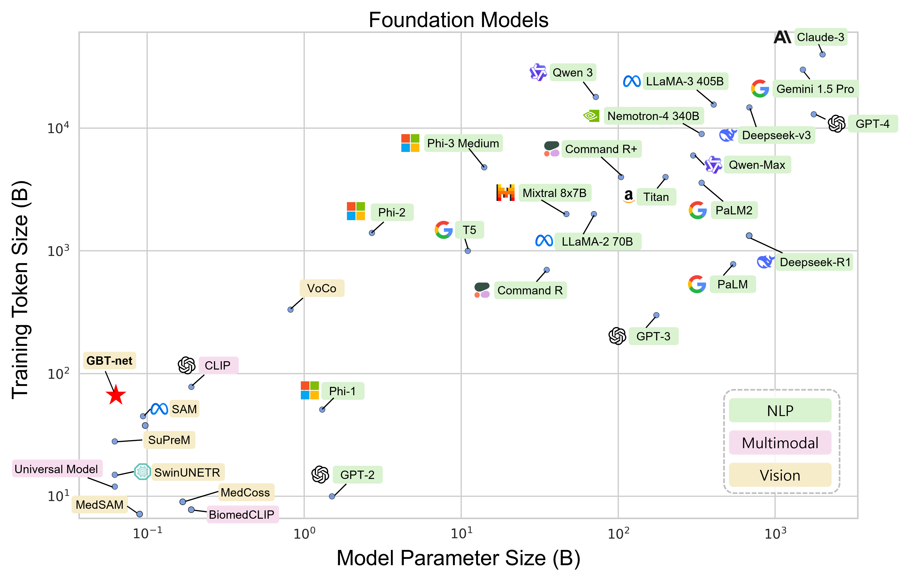

# GBT-net
This GitHub repository is created to share the model weights developed during the **GBT-net** project.

This work was supported by Basic Science Research Program through the National Research Foundation of Korea funded by the Ministry of Science and ICT (2022R1A2C2008983)

  

## Requirements
| Package        | Version |
|----------------|---------|
| Python         | ≥ 3.8   |
| PyTorch        |  2.2.2  |
| monai          |  1.3.0  |

## Pre-training Dataset Overview

| Dataset                          | Modality               | Clinical Status             | Total # of Data                      | Train         | Valid         | Test          |
|----------------------------------|------------------------|-----------------------------|--------------------------------------|---------------|---------------|---------------|
| *Pre-training*                   |                        |                             |                                      |               |               |               |
| ADNI-1                           | MRI                    | AD, MCI, NC                 | 1,179                                | 782           | 196           | 201           |
| AIBL                             | MRI                    | AD, MCI, NC                 | 1,281                                | 1,280         | –             | –             |
| BraTS 2023                       | MRI                    | Brain Tumor                 | 5,004                                | 3,328         | 832           | 844           |
| IXI                              | MRI                    | Normal                      | 2,307                                | 2,307         | –             | –             |
| *Fine-tuning*                    |                        |                             |                                      |               |               |               |
| TCGA                             | MRI                    | IDH-mutant, IDH-wildtype    | 800                                  | 800           | –             | –             |
| UCSF                             | MRI                    | IDH-mutant, IDH-wildtype    | 1,908                                | 1,908         | –             | –             |
| In-house (Hospital A)            | MRI                    | IDH-mutant, IDH-wildtype    | 4,212                                | 2,804         | 704           | 704           |
| FLARE 23                         | CT                     | Normal                      | 4,000                                | 4,000         | –             | –             |
| In-house (Hospital B)            | CT                     | Acute Diseases              | 15,317                               | 15,317        | –             | –             |
| **Total**                        | —                      | —                           | **36,008**                           | **32,526**    | **1,732**     | **1,749**     |

> **Note:** DTI images from the IXI dataset and ADC images from the in-house dataset were excluded due to low quality.  
> **NC** = Normal Cognition &nbsp;•&nbsp; **MCI** = Mild Cognitive Impairment &nbsp;•&nbsp; **AD** = Alzheimer’s Disease &nbsp;•&nbsp; **MRA** = Magnetic Resonance Angiography, **IDH** = Isocitrate Dehydrogenase &nbsp;•&nbsp; **TCGA** = The Cancer Genome Atlas &nbsp;•&nbsp; **UCSF** = University of California, San Francisco  

## Downstream Task Evaluation

| Method            | Backbone         |  Model Params      | ADNI (AUC)            | BraTS2023 (DSC)              | MSD04 (DSC)                  | OASIS-1 (AUC)        |
|-------------------|------------------|--------------------|-----------------------|------------------------------|------------------------------|----------------------|
|  From Scratch     | UNETR            |  249 M (E: 88 M)   | 0.642                 | 82.17                        | 80.17                        | 0.739                |
|  From Scratch     | Swin-UNETR       |  62 M (E: 8 M)     | 0.706                 | 83.83                        | 80.55                        | 0.635                |
|  From Scratch     | Swin-UNETR-v2    |  73 M (E: 18 M)    | 0.849                 | 83.69                        | 81.23                        | 0.778                |
| Swin-UNETR        | Swin-UNETR       |  62 M (E: 8 M)     | <ins>0.944</ins>      | 83.17                        | 80.78                        | <ins>0.878</ins>     |
| VoCo              | Swin-UNETR-v2    |  73 M (E: 18 M)    | 0.924                 | 83.64                        | <ins>81.67</ins>             | 0.843                |
| SuPreM            | Swin-UNETR       |  62 M (E: 8 M)     | 0.917                 | **84.25**                    | 80.76                        | 0.843                |
| Universal Model   | Swin-UNETR       |  62 M (E: 8 M)     | 0.911                 | 83.61                        | **81.99**                    | 0.752                |
| MedCoss           | UNETR            |  249 M (E: 88 M)   | 0.866                 | 82.26                        | 78.96                        | 0.809                |
| **GBT-net**       | Swin-UNETR-v2    |  73 M (E: 18 M)    | **0.950**             | <ins>83.85</ins>             | 81.16                        | **0.943**            |

> **E**: Encoder
> 
> ADNI: Hold-out test set with 5-fold CV ensemble

## Model Weights
The trained model weights for **GBT-net** are provided below.  
Replace the placeholder links with your actual download URLs.

| Backbone       | Pre-training Iterations                     | Download Link |
|----------------|---------------------------------------------|---------------|
| Swin-UNETR-v2  | 50,000 (4 GPUs, batch size 16 per GPU)      | [Download](https://drive.google.com/file/d/1sU9eM6FSyFnovnOddtDjmoqEdQM5GgKo/view?usp=sharing) |

## Usage
Please refer to the [GBT-net Model Loading Notebook](load_model_weight.ipynb) for detailed instructions on how to load and run both the segmentation and classification models.

## License 
See the [LICENSE](LICENSE) file for more details.
